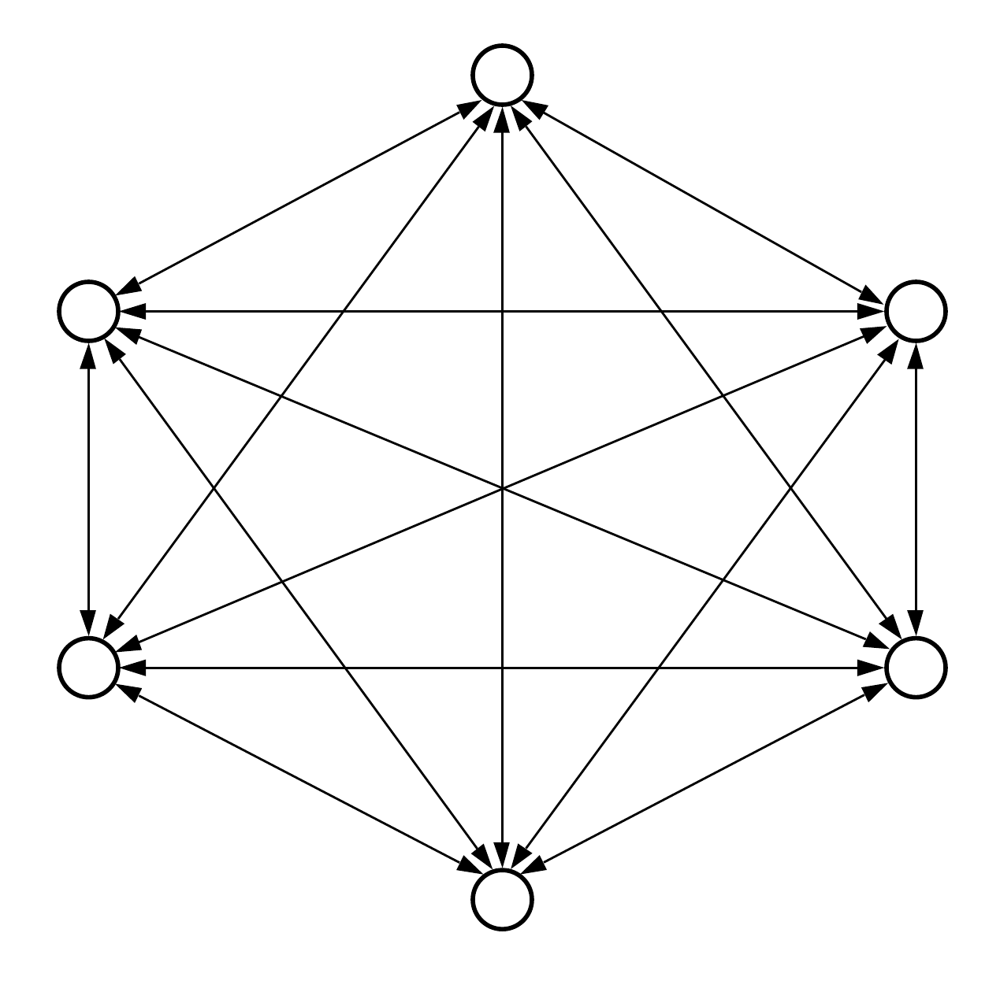

# Videochat com ZMQ
Uma aplicação distribuída para gerenciamento de comunicação por vídeo, áudio e texto entre múltiplos usuários, utilizando a biblioteca ZeroMQ

Nesta plicação foi utilizado o padrão de mensagens publisher/subscribe: um serviço de mensagens assíncrono e escalonável que separa os serviços que produzem mensagens dos serviços que processam essas mensagens. Esse sistema pub/sub tem quatro componentes principais.

##Mensagens
Mensagens são dados de comunicação enviados do remetente ao destinatário. Os tipos de dados de mensagens podem ser qualquer coisa, desde strings de caracteres a objetos complexos representando texto, vídeo, dados de sensores, áudio ou outro conteúdo digital.

##Tópicos
Cada mensagem tem um tópico associado. Esse tópico funciona como um canal intermediário entre emissores e receptores. Ele mantém uma lista de destinatários interessados em mensagens sobre esse tópico.

##Assinantes
Um assinante é o destinatário da mensagem. Os assinantes precisam se registrar (ou assinar) em tópicos de interesse. Eles podem executar funções diferentes ou fazer algo diferente com a mensagem em paralelo.

##Publicador
O publicador é o componente que envia mensagens. Ele cria mensagens sobre um tópico e as envia apenas uma vez a todos os assinantes desse tópico. Essa interação entre o editor e os assinantes é uma relação de um para muitos. O editor não precisa saber quem está usando as informações que está transmitindo, e os assinantes não precisam saber de onde vem a mensagem

Algumas aplicações também utilizam broker: um módulo de programa de computador que permite validação, comunicação e roteamento de mensagens entre aplicativos, sistemas e serviços. Os corretores de mensagens servem como intermediários entre os nós, facilitando assim a troca de mensagens entre publicadores e assinantes. O objetivo principal de um broker é receber mensagens recebidas de aplicativos e executar alguma ação nelas. Os intermediários de mensagens implementam efetivamente o desacoplamento, minimizando a consciência mútua entre os nós.

Nesta aplicação as mensagens pub/sub enviam instantaneamente notificações assíncronas de eventos quando as mensagens são publicadas no tópico da mensagem. Os assinantes são notificados quando uma mensagem está disponível.
Não é utilizado broker. Aqui é utilizado o padrão pub/sub que utiliza uma rede P2P, ou seja, todo nó da rede se inscreve no canal de publicação de todos os outros n-1 nós, permitindo receber notificações de toda a rede. 

A imagem abaixo fornece essa ideia, onde um arco saindo de um nó com sentido a outro indica que este nó de origem é inscrito no canal do nó B. por simplificação, os arcos possuem os dois sentidos indicando que A se inscreve nas publicações de B, e B se inscreve nas publicações de A.

  

